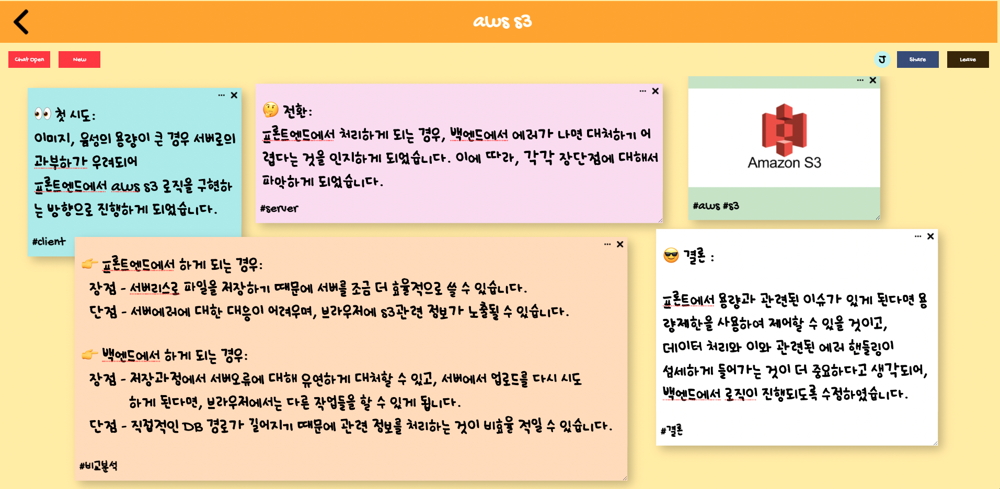

# **🍋 MEMONA-C**


<br>
<br>
쌓여가는 포스트잇에 내가 뭘 적었고, 어디에 붙여놨는지 기억이 안났던 경험이 있지 않나요?<br>
적어둔 메모들을 팀원들과 공유하면 좋겠다... 라는 생각을 해본 적 없으신가요?<br>

그럴 땐, 🍋 **Memona-C** 🍋 를 이용해보세요<br>
**실시간**으로 팀원들과 **메모를 공유**할 수 있고, **채팅**을 통해 의견을 나눌 수 있습니다!

#### 🔗 **[MEMONA-C](https://www.memona-c.com/)**

<br>
<br>
<br>

# **📽 사용 영상**

아래의 이미지를 눌러주세요 !

<br>

[](https://www.youtube.com/watch?v=0LNWE4fIXso)


<br>
<br>
<br>

# **💡 동기**
팀원 모두가 평소 메모를 많이 하는 편인데, 쌓여가는 포스트잇과 작성한 메모들을 공유하기 어려워 뭔가 더 편리한 방법이 없을까? 라는 생각으로 프로젝트를 시작했습니다.<br>
 하루 10시간 이상을 컴퓨터를 사용하기 때문에 웹에 메모지를 붙이는 기능이 있었으면 좋겠다 싶었고, 나아가 이를 공유할 수 있다면 편리할 것 같아 아이디어를 발전시켜 협업 메모툴을 만들기로 결정했습니다.
<br>
<br>
<br>
# **🗓 프로젝트 기간**
- **계획단계 2022.01.24 ~ 01.28**
  - 01.24 : 아이디어 및 기술스택 선정
  - 01.25 : mockup, schema 세팅
  - 01.26 : 전체 작업내용 task 별도 정리
  - 01.27 : task 정리 완료
  - 01.28 : git repository 생성
- **개발단계 2022.02.03 ~ 02.18**
  - 02.03 : 초기 세팅 (client, back 폴더구조 및 기본 세팅)
  - 02.04 : firebase 기반 로그인, 로그아웃, 회원가입 프론트엔드, 백엔드 작업
  - 02.05 ~ 02.06 : 메인페이지 내 CRUD 작업 및 태그 검색 기능 추가
  - 02.07 : socket.io, redux-saga 기초 세팅
  - 02.08 ~ 02.09 : 메모룸 프론트 작업
  - 02.11 ~ 02.15 : 메모 CRUD 및 메모룸 내 채팅기능 구현, socket 연결
  - 02.16 ~ 02.18 : 코드 리팩토링 및 배포, 테스트 코드 작성
<br>
<br>
<br>

# **🔨 기술 스택**


<br>
<br>
<br>

# **📝 실행 방법**
## **Client**

```
https://github.com/memonac/memonac-client.git
npm install 
npm start
```
<br>

## **Server**
```
https://github.com/memonac/memonac-server.git
npm install
npm start // npm run dev (development 버전)
```

<br>
<br>
<br>

# **🔐 환경변수 설정 부분**

### **Client 폴더 최상단에 .env 파일을 생성한 후 아래의 정보를 넣어주세요**

```
REACT_APP_FIREBASE_AUTHDOMAIN=<YOUR_FIREBASE_AUTHDOMAIN>
REACT_APP_FIREBASE_PROJECT_ID=<YOUR_FIREBASE_PROJECT_ID>
REACT_APP_FIREBASE_STORAGE_BUCKET=<YOUR_FIREBASE_STORAGE_BUCKET>
REACT_APP_FIREBASE_MESSAGING_SENDERID=<YOUR_FIREBASE_MESSAGING_SENDERID>
REACT_APP_FIREBASE_APP_ID=<YOUR_FIREBASE_APP_ID>
REACT_APP_FIREBASE_MEASUREMENT_ID=<YOUR_FIREBASE_MEASUREMENT_ID>
REACT_APP_SERVER_URI=http://localhost:8000
```
<br>

### **Server 폴더 최상단에 .env 파일을 생성한 후 아래의 정보를 넣어주세요**
```
DB_ATLAS=<YOUR_MONGODB_URI>
CLIENT=http://localhost:3000

SECRET_KEY=<YOUR_JWT_TOKEN_SECRET_KEY>
FIREBASE_APIKEY=<YOUR_FIREBASE_APIKEY>
FIREBASE_AUTHDOMAIN=<YOUR_FIREBASE_AUTHDOMAIN>
FIREBASE_PROJECT_ID=<YOUR_FIREBASE_PROJECT_ID>
FIREBASE_STORAGE_BUCKET=<YOUR_FIREBASE_STORAGE_BUCKET>
FIREBASE_MESSAGING_SENDERID=<YOUR_FIREBASE_MESSAGING_SENDERID>
FIREBASE_APP_ID=<YOUR_FIREBASE_APP_ID>
FIREBASE_MEASUREMENT_ID=<YOUR_FIREBASE_MEASUREMENT_ID>

GOOGLE_MAIL=<YOUR_EMAIL>
GOOGLE_PASSWORD=<YOUR_APP_PASSWORD>
GOOGLE_PORT=<GOOGLE_PORT>
INVITE_URL=<URL>
NODEMAILER_HOST=<GOOGLE_SERVER>
NODEMAILER_SERVER=<GMAIL>

AWS_BUCKET_REGION=<YOUR_AWS_S3_BUCKET_REGION>
AWS_BUCKET_IDENTITY_POOL_ID=<YOUR_AWS_S3_IDENTITY_POOL_ID>
AWS_ACCESS_KEY_ID=<YOUR_AWS_ACCESS_KEY>
AWS_SECRET_KEY=<YOUR_AWS_SECRET_KEY>
AWS_BUCKET_NAME=<YOUR_AWS_S3_BUCKET_NAME>
```
<br>
<br>
<br>

# **🔬 기능**

- **회원가입 및 로그인**
    - Firebasae AUTH를 통해, 소셜(구글) 및 이메일주소 & 비밀번호 로그인, 회원가입이 가능합니다.
- **메모 메인페이지**
    - 로그인한 유저가 참여중인 메모룸이 리스트로 보여집니다.
    - 메모룸은 메인페이지 내 NEW 버튼을 통해 생성 가능합니다.
    - 삭제 및 메모룸 이름 수정은 개별 메모룸 리스트 내 상단에 위치한 햄버거 버튼 클릭시 가능합니다.
        - 해당 메모룸을 생성한 유저만 메모룸을 삭제할 수 있습니다.
    - 왼쪽 사이드바에는 본인이 참여한 모든 메모룸들의 태그가 나열되며, 태그 검색을 통해 원하는 메모룸을 찾을 수 있습니다.
- **메모룸 상세 페이지**
    - 새 메모 추가 기능
        - NEW 버튼을 누르면 메모 생성과 관련된 화면이 나타납니다.
        - Text, Image, Voice 총 3가지의 타입, 새 메모 색상, 태그들을 입력할 수 있습니다.
    - 메모 수정 및 삭제 기능
        - 메모의 색상, 태그, 크기, 위치를 수정할 수 있으며, 수정되거나 삭제된 메모는 실시간 통신을 이용해 메모 협업 공간에 참여한 모든 사람들의 메모룸에 반영됩니다.
    - 메모룸 초대 기능
        - 메모룸 내 SEND 버튼을 통해 초대 메일을 발송할 수 있으며, 초대 받은 사람은 메일의 링크를 통해 해당 메모룸에 입장할 수 있습니다. (단, 이 서비스에 가입된 사용자에 한합니다.)
    - 메모룸 나가기 기능
        - 메모룸 내 LEAVE 버튼을 통해 참여중인 메모룸을 나갈 수 있습니다. (메모룸의 owner는 나갈 수 없습니다)
        - 메모룸을 나가게 되면, 현재 참여하고 있는 메모룸 리스트에서 삭제됩니다.
    - 채팅 기능
        - CHAT OPEN 버튼을 통해 이 방에 참여하고 있는 사용자는 실시간으로 채팅할 수 있습니다.
        - 채팅한 내용은 해당 메모룸에 들어와있지 않았던 참여자에게도 보여집니다.
    - 참여자 렌더링
        - 오른쪽 상단에 메모룸에 참여하고 있는 사람들을 볼 수 있습니다.
<br>
<br>
<br>

# **🤔 이슈 & 고민되었던 부분**
**1. Socket & DB 통신**
<br>
<br>

<br>

<br>
<br>
**2. AWS S3 로직 처리 위치**
<br>
<br>

<br>
<br>
**3. 초대 메일 인증 처리**
<br>
<br>

<br>
<br>
<br>

# **🔧 보완해야 하는 부분**


<br>

<br>
<br>
<br>

# **🎤 소감**


<br>
<br>
<br>
